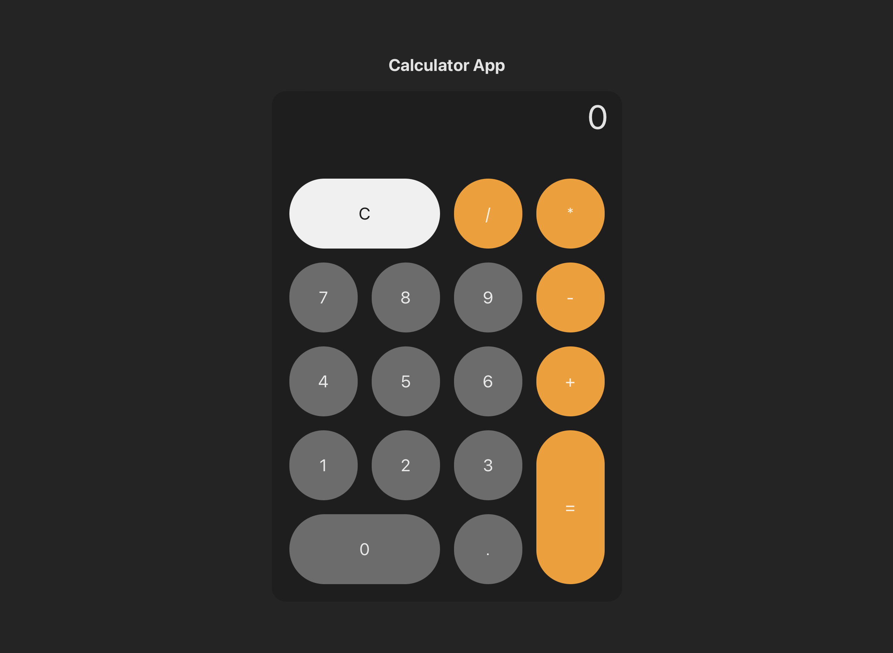

## React Calculator
🚀 [DEMO]()

Una calculadora simple e interactiva construida con React. Esta aplicación permite realizar operaciones aritméticas básicas, como suma, resta, multiplicación y división. También admite la entrada de decimales y redondeo adecuado para los resultados.

## 📱💻 Vista en dispositivos 

 

## 🙌 Inspiración

Este proyecto está basado en el desafío [Build a JavaScript Calculator](https://www.freecodecamp.org/learn/front-end-development-libraries/front-end-development-libraries-projects/build-a-javascript-calculator) del curso Front End Development Libraries de FreeCodeCamp. 

## ✨ Características

- Operaciones aritméticas básicas: suma, resta, multiplicación, división.
- Entrada de punto decimal para cálculos de números flotantes.
- Redondeo del resultado a 4 decimales.
- Botón de "Limpiar" para resetear la calculadora.

## 🛠️ Tecnologías

- **React**
- **CSS3** 

